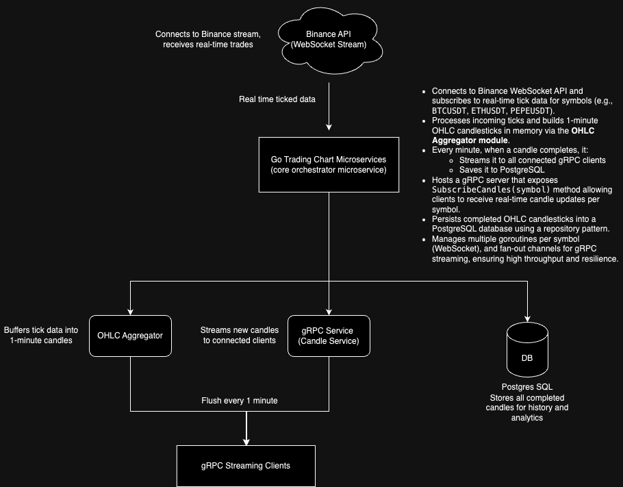

# Trading Chart Service

A high-performance service that fetches real-time tick data from Binance, aggregates into OHLC candlesticks, streams via gRPC, and stores data in PostgreSQL.

## Features
- Real-time Binance WebSocket integration
- 1-minute OHLC aggregation
- gRPC streaming API
- PostgreSQL persistence
- Docker + Kubernetes ready
- Terraform for infrastructure

## Quick Start (Local Dev)

### Prerequisites
- Docker
- `protoc` (for gRPC codegen)

### Run locally

```bash
cd docker
docker-compose up --build
```

## High-Level Architecture



## Infrastructure

- Kubernetes Cluster(s) (via Helm + Terraform IaC)
- Docker Container (Go Microservices)
- Postgres StatefulSet (PVC-backed Storage) 

## CI/CD 

- `docker-compose` for local dev
- `protoc` for gRPC codegen
- `go test` for unit testing
- Terraform + Kubernetes for deploy

## Further optimization 

- To implement a good UI/UX in Vue/Nuxt to display the Binance ticked data in real-time 